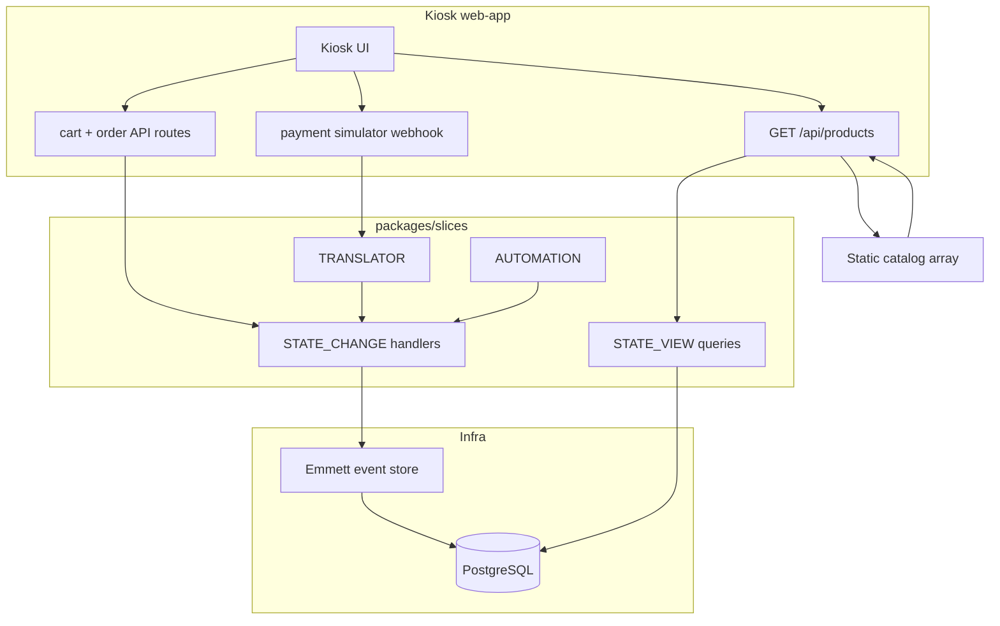

# Complete Store Checkout (EM + infra + docs)

**Completed:** 2026-09-30 — Phase 4 verification passed (`make setup`, `pnpm test`, `pnpm lint`, `pnpm build`, `pnpm em:slice:check-drift --all`; API smoke via `make health`, `GET /api/products`, `POST /api/cart`). Living copy during implementation: `.cursor/plans/em_checkout_completion_3883e44f.plan.md`.

## As shipped (2026-09-30)

| Area | Status |
|------|--------|
| EM snapshot | **`20260930011438_store`** (`packages/em-manager/manifest.json`) |
| Slices | 19 × handlers registered; drift clean |
| Kiosk | Server cart (`cart_id` cookie), Stock Products List menu, checkout + status UI |
| Postgres | Makefile `db-up` / `db-reset`; Emmett migrates on first API use |
| Logging | `withLoggedApiRoute` on API routes; structured stdout logs |
| Local setup | [`docs/LOCAL_SETUP.md`](../LOCAL_SETUP.md) + root [`Makefile`](../../Makefile) |
| Product menu | Static [`product-catalog.ts`](../../apps/web-app/src/lib/kiosk/product-catalog.ts); `available = quantity − reserved − sold` |



---

## Phase 0 — Foundation (do once before slice loop)

### 0.1 Postgres + env + Makefile

Add root [`Makefile`](Makefile) (single entry point; call existing pnpm scripts):

| Target | Purpose |
|--------|---------|
| `check-deps` | Node ≥24 ([`.nvmrc`](.nvmrc)), pnpm ≥10, Docker CLI, `docker compose` |
| `env` | `cp -n apps/web-app/.env.example apps/web-app/.env.local` |
| `db-up` / `db-down` / `db-reset` | Wrap `docker compose` (+ `down -v` for reset) |
| `install` | `pnpm install` |
| `setup` | `check-deps` → `env` → `db-up` → `install` → wait for pg healthcheck → `curl /api/health` |
| `dev` | `pnpm dev` |
| `test` / `lint` / `build` | Existing turbo scripts |

Expand [`apps/web-app/.env.example`](apps/web-app/.env.example) if needed (document vars used by health/logging). Optional root [`.env.example`](.env.example) that points to `apps/web-app/.env.example` for discoverability.

**Docs:** Rewrite [`docs/LOCAL_SETUP.md`](docs/LOCAL_SETUP.md) around `make setup` / `make dev`; link from [`docs/project/README.md`](docs/project/README.md) and root [`README.md`](README.md) if present.

**Decision log:** [`docs/project/DECISIONS.md`](docs/project/DECISIONS.md) — Makefile as canonical bootstrap; Node 24 engine requirement.

**Lessons:** [`tasks/lessons.md`](tasks/lessons.md) — e.g. engine mismatch on Node 22 vs 24 if hit during setup.

### 0.2 Static catalog + computed availability (no DB seed)

Per EM model and your direction — **no seed script, no bootstrap stock events in Postgres**:

- Keep the menu as a **static array in the web-app** (refactor [`catalog.ts`](apps/web-app/src/lib/kiosk/catalog.ts) into a clear module e.g. [`apps/web-app/src/lib/kiosk/product-catalog.ts`](apps/web-app/src/lib/kiosk/product-catalog.ts)): `id`, display fields (name, image, category), **`stock_id`** (stable UUID aligned with EM), **`quantity`** (initial on-hand count from the static array), `price_in_cents`.
- **Current stock** for the kiosk follows the EM **Stock Products List** read model (board `READMODEL`, not a 20th `slice.ref.json` slice): implement it **within the stock-related slices** that need it — inline projection(s) for reserved/sold per `stock_id`, plus a query that **wraps** the web-app static catalog with those projections:

  **`available = catalog.quantity − reserved − sold`**

  Reserved/sold counts come from **ReserveStockItem**, **DereserveStockItem**, and **SellStockItem** events. Do not mutate the static array at runtime.
- **Web-app:** keeps display/config data only ([`product-catalog.ts`](apps/web-app/src/lib/kiosk/product-catalog.ts) or refactored [`catalog.ts`](apps/web-app/src/lib/kiosk/catalog.ts)); **`GET /api/products`** calls into **`packages/slices`** (route → slice read handler), not ad-hoc SQL in the route.
- Document in [`docs/project/EVENT_MODEL.md`](docs/project/EVENT_MODEL.md): Stock Products List = read model composition; static `initial_products` lives in web-app, dynamic fields from projections.

### 0.3 API logging standard (apply to all new/changed routes)

Pattern already in [`health/route.ts`](apps/web-app/src/app/api/health/route.ts):

- Wrap handlers with `withAxiomRouteHandler`
- Use `logger` from [`@/lib/logger`](apps/web-app/src/lib/logger.ts) with structured fields:
  - `correlationId`, `route`, `method`, `durationMs`, `commandType` / `aggregateId`, `success`, `error` (no PAN/card data — align with DECISIONS)
- Refactor existing [`products/route.ts`](apps/web-app/src/app/api/products/route.ts) and [`orders/route.ts`](apps/web-app/src/app/api/orders/route.ts) when replaced

Optional small helper: `logApiRequest()` in `apps/web-app/src/lib/api-log.ts` to avoid duplication.

---

## Phase 1 — Slice implementation order (generate → implement → register → route → test)

**Per-slice loop** (from [`docs/SLICE_IMPLEMENTATION_WORKFLOW.md`](docs/SLICE_IMPLEMENTATION_WORKFLOW.md)):

```bash
pnpm em:slice:generate packages/slices/src/<SliceDir>
pnpm em:slice:implement packages/slices/src/<SliceDir>
# follow type-specific POST_GENERATION_PLAN.md + POST_GENERATION_CHECKLIST.md
pnpm --filter @store-checkout/slices exec vitest run <SliceDir>
pnpm em:slice:mark-status packages/slices/src/<SliceDir> Done
```

After each slice (or logical batch): update [`docs/project/EVENT_MODEL.md`](docs/project/EVENT_MODEL.md) status column, [`tasks/todo.md`](tasks/todo.md), and **append** [`tasks/lessons.md`](tasks/lessons.md) with non-obvious findings.

### Recommended order (19 slices + kiosk milestones)

**Milestone A — Stock (menu availability)**

1. **ReserveStockItem** — Stock aggregate; guards for insufficient stock  
2. **DereserveStockItem**  
3. **SellStockItem**  
4. Implement **Stock Products List** read model in slices (projection + query wrapping web-app static catalog with reserved/sold); register in [`projections-inline.ts`](packages/slices/src/projections-inline.ts); wire **`GET /api/products`** through slice read API

**Milestone B — Cart (kiosk session)**

5. **CreateCart**  
6. **AddItemToCart** — implement cart aggregate only; **do not** wire ReserveStockItem, automations, or “reserved before add” constraints yet (EM storyline/GWT deferred to a later milestone)  
7. **RemoveItemFromCart**  
8. **ClearCart**  
9. **CartDetails** (STATE_VIEW) — back cart UI / server cart id  

Wire kiosk: replace client-only cart with `cart_id` cookie/header + new API routes (thin `route.ts` → slice `routes.ts`).

**Milestone C — Order + payment**

10. **CreateOrder** (Cart aggregate)  
11. **PayOrder**  
12. **FailOrderPayment**  
13. **FinishOrder**  
14. **ExternalPaymentSimulatorTranslator** — HTTP boundary for simulated provider payload → internal commands  
15. Replace [`POST /api/orders`](apps/web-app/src/app/api/orders/route.ts) with: create order + invoke translator (success/fail paths per spec)

**Milestone D — Read models**

16. **PaymentFailedOrder** (STATE_VIEW)  
17. **OrderFinishedDetails** (STATE_VIEW) — confirmation screen data  

**Milestone E — Automations (after all target SC handlers registered)**

18. **CartClearedAutomator**  
19. **OrderPaidAutomator**  
20. **SoldItemsOrderAutomator**  
21. **WebhookSimulatorAutomator** — local/dev trigger for translator (document URL in LOCAL_SETUP)

Register automations in [`commands.ts`](packages/slices/src/commands.ts) / message bus subscriptions per [`AUTOMATION_POST_GENERATION_PLAN.md`](packages/em-slice-generator/AUTOMATION_POST_GENERATION_PLAN.md).

**After all STATE_VIEW slices:** run [`pnpm rebuild:projections --all`](package.json) once; document in EVENT_MODEL + [`docs/PROJECTION_REBUILD_PLAN.md`](docs/PROJECTION_REBUILD_PLAN.md).

### Registration checklist (every SC / SV)

- Handler → [`packages/slices/src/commands.ts`](packages/slices/src/commands.ts)  
- Inline projections → [`projections-inline.ts`](packages/slices/src/projections-inline.ts)  
- State views → [`projections-registry.ts`](packages/slices/src/projections-registry.ts) + [`manual-rebuild-config.ts`](packages/slices/src/manual-rebuild-config.ts) if generated  
- Events → [`packages/core/src/events/`](packages/core/src/events/)  
- API → [`apps/web-app/src/app/api/.../route.ts`](apps/web-app/src/app/api/) per [`api/README.md`](apps/web-app/src/app/api/README.md)  
- Export UI only if slice has admin screens (kiosk may skip most slice UI)

**Access hardening (apply when wiring / before production):**

1. **Production kiosk gate** — In **production** only (`NODE_ENV=production`), when **`KIOSK_ACCESS_MAGIC_WORD`** is set: access-code form on **`/`** → **`POST /api/kiosk/access`** sets an **HttpOnly** signed **`kiosk_session`** cookie. Middleware requires that cookie on **`/api/*`** except health, kiosk routes, and **`/api/webhooks/payment`** (simulator). Prefer **`KIOSK_SESSION_SECRET`** for cookie signing. Local dev: leave magic word unset. Document in DECISIONS + LOCAL_SETUP; do not commit secrets.

---

## Phase 2 — Documentation map (keep in sync during implementation)

| Document | Updates |
|----------|---------|
| [`docs/project/EVENT_MODEL.md`](docs/project/EVENT_MODEL.md) | Slice table + status, dependency order, API map, **Stock Products List** read model (static + projections) |
| [`docs/project/DECISIONS.md`](docs/project/DECISIONS.md) | Chronological decisions: static catalog (no DB seed), availability formula, cart session, payment sim boundary, logging |
| [`docs/LOCAL_SETUP.md`](docs/LOCAL_SETUP.md) | Makefile, env, Docker, health, optional Axiom/Sentry |
| [`docs/project/README.md`](docs/project/README.md) | Link setup + EVENT_MODEL status; after completion, link to [`docs/plans/em-checkout-completion.md`](docs/plans/em-checkout-completion.md) |
| [`tasks/todo.md`](tasks/todo.md) | Phase/milestone checkboxes |
| [`tasks/lessons.md`](tasks/lessons.md) | **Append during implementation** (not only at end): registration gotchas, projection rebuild, kiosk wiring, EM spec ambiguities |

---

## Phase 3 — Kiosk completion (after Milestone C)

- [`packages/ui/src/hooks/use-cart.ts`](packages/ui/src/hooks/use-cart.ts) / order flow → server `cart_id`, command dispatch  
- Remove in-memory `placeOrder` / local stock mutation from catalog module; keep **static catalog array** + types; availability only via projection formula  
- Idle guard / payment dialog → real API outcomes (409 stock conflict, payment failed view)  
- End-to-end manual test script in LOCAL_SETUP: start → add items → pay → pick up number

---

## Phase 4 — Verification gates

Before calling the project complete:

```bash
make setup
pnpm test
pnpm lint
pnpm build
pnpm em:slice:check-drift --all
```

Manual: kiosk happy path + payment failure path; `curl` API routes; confirm logs on stdout (and Axiom if configured).

### 4.1 Archive implementation plan (last step)

When verification passes and the project is complete:

1. Copy this plan into the repo as [`docs/plans/em-checkout-completion.md`](docs/plans/em-checkout-completion.md) (create `docs/plans/` if missing).
2. Remove Cursor-only frontmatter if desired; keep the body as the historical record (milestones, order, decisions as implemented).
3. Add a short **Completed** header with date and link from [`docs/project/README.md`](docs/project/README.md) (and optionally [`tasks/todo.md`](tasks/todo.md)) to the archived plan.

Do not copy until work is done — the living plan stays in `.cursor/plans/` during implementation.

---

## Design notes (document in DECISIONS / lessons.md when implementing)

- **Stock Products List** (EM `READMODEL` in migration JSON) is **not** a separate scaffolded slice among the 19 refs; it is the **read model to implement inside stock-related slices** — projections for reserved/sold plus a query that combines web-app static catalog with `available = quantity − reserved − sold`. Reserve/Sell flows and **`GET /api/products`** consume this read model.
- **Node 24** is required by `package.json` engines; Makefile `check-deps` should fail fast with `.nvmrc` hint  
- **Tutorial snapshot tests** (e.g. status-merge) vs store snapshot — keep manifest on `20260929200131_store` for product work  
- Full-screen start button + scroll: keep [`start-screen.tsx`](packages/ui/src/kiosk/start-screen.tsx) scroll port pattern when touching UI
