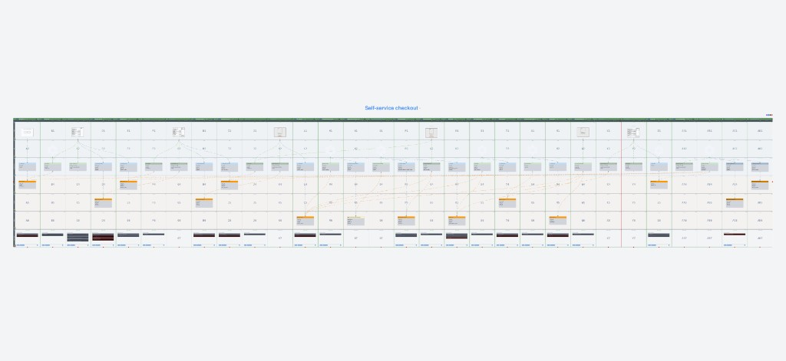

# Event model

**Board:** MashginCheckout  
**Snapshot:** `20260930011438_store` (`packages/em-manager/migrations/`, `manifest.json` → `currentSnapshot`). Supersedes `20260929231730_store` (adds **Spec:** “Do not dereserve sold item” on **Dereserve Stock Item**). Re-export can reset border **`sliceStatus`** to `Planned`; merge from `slice.ref.json` before committing migrations.

## Board diagram (Event Modelers export)

Full **Self-service checkout** board timeline (commands, events, read models, UI wireframes). Source: [Event Modelers](https://app.eventmodelers.ai/) — export dated 2026-09-30; aligned with snapshot **`20260930011438_store`**. Re-export from the live board when the migration changes.

Planned slices (prefix = EM type: SC state change, SV state view, AUT automation, TR translator):

**Dependency order (milestones):** stock (Reserve → Dereserve → Sell + Stock Products List) → cart (Create → Add → Remove → Clear + Cart Details) → order + translator (Create → Pay / Fail → Finish) → read models (Payment Failed Order, Order Finished Details) → automators (Cart Cleared, Order Paid, Sold Items, Webhook Simulator). See [SLICE_IMPLEMENTATION_WORKFLOW.md](../SLICE_IMPLEMENTATION_WORKFLOW.md).

| Slice | Status |
|-------|--------|
| [SC] Create Cart | **Done** — `packages/slices/src/CreateCart/` |
| [SC] Add Item to Cart | **Done** — `packages/slices/src/AddItemToCart/` |
| [SC] Remove Item from Cart | **Done** — `packages/slices/src/RemoveItemFromCart/` |
| [SC] Clear Cart | **Done** — `packages/slices/src/ClearCart/` |
| [SC] Reserve Stock Item | **Done** — `packages/slices/src/ReserveStockItem/` |
| [SC] Dereserve Stock Item | **Done** — `packages/slices/src/DereserveStockItem/` |
| [SC] Create Order | **Done** — `packages/slices/src/CreateOrder/` |
| [SC] Pay Order | **Done** — `packages/slices/src/PayOrder/` |
| [SC] Fail Order Payment | **Done** — `packages/slices/src/FailOrderPayment/` |
| [SC] Sell Stock Item | **Done** — `packages/slices/src/SellStockItem/` |
| [SC] Finish Order | **Done** — `packages/slices/src/FinishOrder/` |
| [SV] Cart Details | **Done** — `packages/slices/src/CartDetails/` (includes **Stock Products List** read model) |
| [SV] Payment Failed Order | **Done** — `packages/slices/src/PaymentFailedOrder/` |
| [SV] Order Finished Details | **Done** — `packages/slices/src/OrderFinishedDetails/` |
| [AUT] Cart Cleared Automator | **Done** — `packages/slices/src/CartClearedAutomator/` |
| [AUT] Webhook Simulator Automator | **Done** — `packages/slices/src/WebhookSimulatorAutomator/` (server POST to `/api/webhooks/payment`) |
| [AUT] Order Paid Automator | **Done** — `packages/slices/src/OrderPaidAutomator/` |
| [AUT] Sold Items Order Automator | **Done** — `packages/slices/src/SoldItemsOrderAutomator/` |
| [TR] External Payment Simulator Translator | **Done** — `packages/slices/src/ExternalPaymentSimulatorTranslator/` |

Implement in dependency order per [SLICE_IMPLEMENTATION_WORKFLOW.md](../SLICE_IMPLEMENTATION_WORKFLOW.md). Slice refs: `packages/slices/src/<SliceDir>/slice.ref.json` after `pnpm em:slice:init --all-planned`.

## Stock Products List (read model — in Cart Details)

The board defines read model **Stock Products List** (`READMODEL` in the migration JSON). **Not a separate slice** — implemented inside **[SV] Cart Details** (static catalog + reserved/sold projections).

| Source | Role |
|--------|------|
| [`apps/web-app/src/lib/kiosk/product-catalog.ts`](../../apps/web-app/src/lib/kiosk/product-catalog.ts) | Static `initial_products` (no DB seed). Shared `stockId` per `STOCK_SOURCES` |
| Stock stream (`stock_id`) | Events `StockItemReserved`, `StockItemDereserved`, `StockItemSold` — handlers in `ReserveStockItem`, `DereserveStockItem`, `SellStockItem` |
| Stock invariants | On **`StockItemSold`**, reservation for that **`cart_id` + `item_id`** is consumed in decider `evolve` (keep the three stock handlers in sync). **`DereserveStockItem`** emits nothing if that cart line was sold (EM spec). |
| Target formula | **`available = quantity − reserved − sold`** per `item_id` |
| Inline projection | `StockProductsList` — `stock-products-list-collection` |
| API | `GET /api/products` uses `buildStockProductsList` + Pongo projection |

## Kiosk client refresh

| Read path | API | Client behavior |
|-----------|-----|-----------------|
| Stock Products List (menu + `stock` badges) | `GET /api/products` | SWR in `@store-checkout/ui` — poll every **15s**, revalidate on window focus ([`use-products.ts`](../../packages/ui/src/hooks/use-products.ts)) |
| Cart Details (line items, totals) | `GET /api/cart` | Fetch on mount + after mutations only — [`CartDetails.tsx`](../../packages/slices/src/CartDetails/ui/CartDetails.tsx); no interval |
| Session (start vs order) | `GET /api/kiosk/session` then `GET /api/cart` | On mount — [`apps/web-app/src/app/page.tsx`](../../apps/web-app/src/app/page.tsx); production gate when `KIOSK_ACCESS_MAGIC_WORD` is set |

Rationale: shared stock read model can change without this kiosk issuing commands; cart state is owned by this session’s commands. Documented in [DECISIONS.md](./DECISIONS.md).

## Cart stream events (Add / Remove)

| Event | Notable payload fields |
|-------|-------------------------|
| `ItemAddedToCart` | `cart_id`, `stock_id`, `item_id`, **`price_in_cents`**, `quantity`, `added_at` |
| `ItemRemovedFromCart` | `cart_id`, `stock_id`, `item_id`, **`price_in_cents`**, `quantity`, `removed_at` |

Commands **Add Item to Cart** and **Remove Item from Cart** include **`price_in_cents`** (from static catalog at dispatch in `POST`/`DELETE` `/api/cart/items`).

**API orchestration:** those routes dispatch **`ReserveStockItem` then `AddItemToCart`**, or **`DereserveStockItem` then `RemoveItemFromCart`**, with rollback if the cart step fails after stock succeeds. See [DECISIONS.md](./DECISIONS.md).

## HTTP API (kiosk + checkout)

Full route notes: [`apps/web-app/src/app/api/README.md`](../../apps/web-app/src/app/api/README.md).

| Method | Path | Commands (order) | Notes |
|--------|------|------------------|--------|
| `GET` | `/api/health` | — | Public; Postgres ping |
| `GET` | `/api/kiosk/session` | — | `{ gateEnabled, authorized }` (exempt from session cookie) |
| `POST` | `/api/kiosk/access` | — | Magic word → HttpOnly `kiosk_session` (production gate) |
| `POST` | `/api/cart` | `CreateCart` | Sets HttpOnly `cart_id` cookie |
| `GET` | `/api/cart` | — | Cart Details projection → kiosk cart map |
| `DELETE` | `/api/cart` | end session | Clears cookie (see route) |
| `POST` | `/api/cart/items` | `ReserveStockItem` → `AddItemToCart` | Body: `productId`, optional `quantity`; catalog supplies `stock_id`, `item_id`, `price_in_cents`, `on_hand_quantity` |
| `DELETE` | `/api/cart/items` | `DereserveStockItem` → `RemoveItemFromCart` | Same body shape as POST |
| `POST` | `/api/cart/clear` | `ClearCart` | Stock dereserve via **`CartCleared`** → **Cart Cleared Automator** (see below) |
| `GET` | `/api/products` | — | Stock Products List projection + static catalog |
| `POST` | `/api/orders` | `CreateOrder` | Kiosk checkout; returns ids for payment simulator |
| `POST` | `/api/webhooks/payment` | External payment translator → `PayOrder` / `FailOrderPayment` | Simulated provider callback |
| `GET` | `/api/orders/status` | — | Poll `cart_id` + `order_id` → payment read models |

Orchestration lives in `packages/slices/src/AddItemToCart/routes.ts` and `RemoveItemFromCart/routes.ts`; thin handlers in `apps/web-app/src/app/api/cart/**`.

## Automations (message bus)

Registered in `packages/slices/src/automations.ts` (`registerAllAutomations` on app startup).

| Trigger | Automator | Action |
|---------|-----------|--------|
| `CartCleared` | **Cart Cleared Automator** | Read **`ClearedCartItems`** projection (`CartClearedAutomator/ClearedCartItemsProjection.ts`); for each cleared line, **`RemoveItemFromCart`** route with **`cartAlreadyCleared: true`** (dereserve only). Sold lines no-op at **`DereserveStockItem`**. |
| `OrderPaid` | **Order Paid Automator** | `SellStockItem` per order line |
| `StockItemSold` | **Sold Items Order Automator** | `FinishOrder` when all order lines sold |
| `OrderCreated` | **Webhook Simulator Automator** | Delayed POST to `/api/webhooks/payment` when kiosk passes `simulationStatus` on create order |

**Checkout success path (simplified):** `CreateOrder` → webhook → `PayOrder` → `OrderPaid` → sells → optional `FinishOrder`; kiosk clears cart → `CartCleared` → automator dereserves **unsold** reserved lines only.

## Order checkout status

`GET /api/orders/status` — handler in `CartDetails/routes.ts` (`handleOrderCheckoutStatusRoute`); UI polls via `@store-checkout/ui` (`use-order-checkout-status`) from **Order Finished Details** / **Payment Failed Order** projections.

## Inline projections (Pongo)

Each read model below is stored in a **normal PostgreSQL table** in the same database as domain events (`emt_messages`). Tables are **updated on every appended event** that the projection handles (via `evolve` registered in `projections-inline.ts`). See [PROJECTION_REBUILD_PLAN.md](../PROJECTION_REBUILD_PLAN.md) for collection names, rebuild, and a Neon table screenshot.

Registered in `packages/slices/src/projections-inline.ts` and rebuildable via [PROJECTION_REBUILD_PLAN.md](../PROJECTION_REBUILD_PLAN.md):

| Registry key | Collection | Primary consumer |
|--------------|------------|------------------|
| `CartDetails` | `cartdetails-collection` | `GET /api/cart` |
| `StockProductsList` | `stock-products-list-collection` | `GET /api/products` |
| `PaymentFailedOrder` | `paymentfailedorder-collection` | `GET /api/orders/status` |
| `OrderFinishedDetails` | `orderfinisheddetails-collection` | `GET /api/orders/status` |
| `ClearedCartItems` | `clearedcartitems-collection` | **Cart Cleared Automator** (dereserve cleared lines) |

## Production API access

When **`NODE_ENV=production`** and **`KIOSK_ACCESS_MAGIC_WORD`** is set, middleware requires a signed **`kiosk_session`** cookie on `/api/*` except health, kiosk routes, and **`/api/webhooks/payment`**. See [DECISIONS.md](./DECISIONS.md) and [LOCAL_SETUP.md](../LOCAL_SETUP.md).
